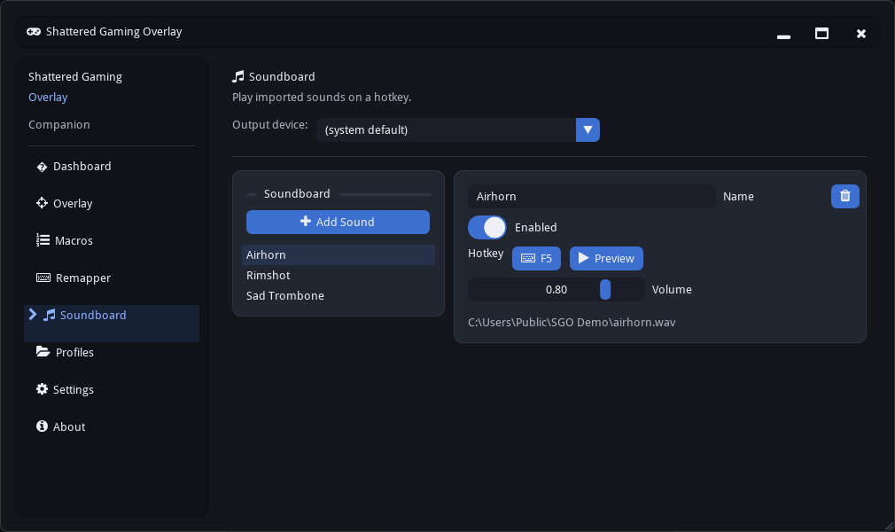
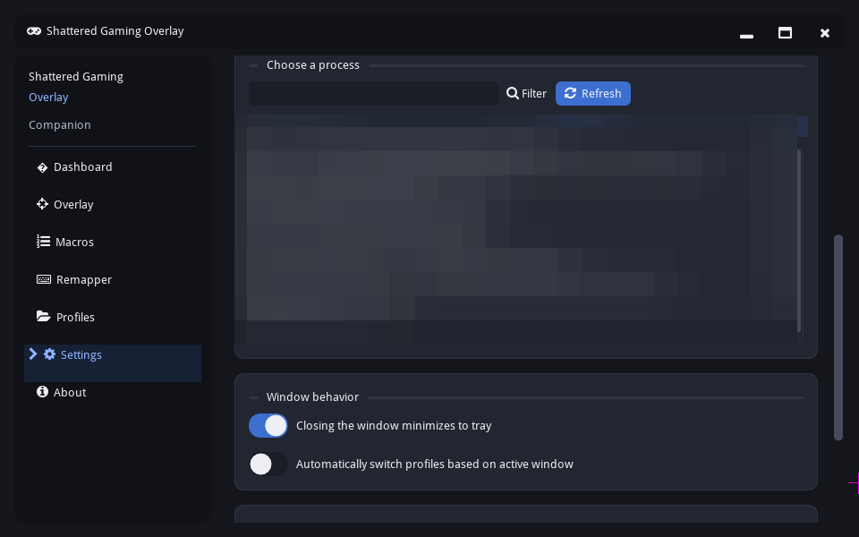

# Shattered Gaming Overlay

A gaming accessibility companion for Windows — remap keys and mouse buttons, build macros, run a live stats/crosshair overlay, switch configs per game, and play imported sounds on a hotkey. No kernel driver, no virtual controller, no reading game memory. Just user-mode Win32 input APIs, the same layer AutoHotkey runs on.

## Features

### Remapper

Two sections, two different jobs. **Remapping** is a plain 1:1 swap — bind any key or mouse button to another, and the destination mirrors the source's down/up at whatever frequency you press it. **Auto Toggle/Hold** works on a single key by itself: **Toggle** latches it down on the first press and releases it on the next, and **Hold** taps the key on both the press and release of your physical key — handy for games like FromSoft titles that hard-code sprint or crouch as toggle-only and won't let you rebind the behavior. Every entry, in either section, can be given its own name so a long list of remaps stays easy to keep track of. A remap's destination (or an Auto entry's own key) also arms macros and status tracking, so the rest of the app reacts to what you actually intended to press, not just the raw key.

### Macros

Record a sequence and play it back with Once, Hold, or Toggle triggers. Playback timing is humanized rather than robotically exact. Delay steps take any value you want — drag to adjust or type an exact number in, no arbitrary cap.

Triggers can be a single key or a combo like **Shift + R** — press the whole combination once while binding and it's captured in one go. Steps can be recorded live or built by hand, and the up/down arrows at the left of each step let you reorder them without deleting and re-adding anything.

### Soundboard

Import your own sound clips (WAV, MP3, OGG, or FLAC), give each one a hotkey, and play it on demand — a sound fires the moment you press its key. Each clip has its own volume slider, an enabled toggle, and a Preview button so you can audition it without leaving the app. Clips can overlap, so hitting a second hotkey doesn't cut off the first. If a file gets moved or deleted, the clip is flagged in the panel instead of failing silently.

Pick which speakers or output the sounds play through from the **Output device** dropdown at the top of the panel; it defaults to your system default. Clips are referenced by their location on disk rather than copied, and the soundboard is saved separately from profiles, so switching profiles never changes your sound list. Like Remapper and Macros, hotkeys go inert when a targeted window loses focus.

#### Using the soundboard in voice chat

Playing a sound so *other people* hear it — in Discord, in-game voice, on a stream — needs a virtual audio cable. Shattered Gaming Overlay deliberately doesn't install an audio driver of its own (same reasoning as [Why no driver](#why-no-driver)), so you bring a free third-party one such as [VB-CABLE](https://vb-audio.com/Cable/) or [VoiceMeeter](https://vb-audio.com/Voicemeeter/). A virtual cable is a fake device with two ends: whatever is played into its "input" comes out of its "output", where any app can pick it up as if it were a microphone.

1. Install the virtual cable and reboot if the installer asks.
2. In the Soundboard panel, set **Output device** to the cable's playback end — **CABLE Input** for VB-CABLE.
3. In Discord, your game's voice chat, or OBS, set the microphone to the cable's recording end — **CABLE Output**.
4. Press a sound's hotkey. Your teammates hear it.

Two things worth knowing:

- **You won't hear it yourself by default**, because the sound is going into the cable rather than your speakers. To monitor it, open Windows **Sound** settings → **Recording** → double-click **CABLE Output** → **Listen** tab → tick **Listen to this device** and pick your headphones.
- **Voice apps only listen to one microphone**, so with the cable selected as your mic, your real voice is no longer being sent. To transmit both, use a mixer like VoiceMeeter to combine your real mic and the cable into a single virtual microphone, and point your voice app at that instead.

If you only want to hear sounds yourself, none of this is needed — leave the output on **(system default)** or pick your headphones.

### Profiles

Save named configs per game — Remapper, Macros, window targeting, and Overlay settings all travel together. Point a profile at a game by picking it from a live list of what's currently running — no typing an exact filename — and turn on auto-switch in Settings, and it loads itself the moment that game gets focus. Export a profile to a file and hand it to a friend; importing one always adds it as new, so you never lose your own setup by accident.

*(One profile's row blurred for privacy — it just names a specific game.)*

### Overlay

A passive HUD that sits over the game: CPU/GPU load and temps, VRAM/RAM, FPS with 1% and 0.1% lows plus a live graph, an accessibility crosshair, and status indicators for what's currently active. It's a separate, click-through window — never a hook into the game's own renderer, and never something you can accidentally interact with mid-match.

### Window targeting

Point the app at one running process instead of leaving it global, and Remapper and Macros go inert the instant that process loses focus — nothing you've bound reaches the rest of your desktop while you're alt-tabbed out. The list refreshes on its own every couple seconds, or force it with the button. If the targeted game restarts partway through your session, the app quietly finds it again on its own — no need to reselect it.

*(Process list blurred for privacy — it's just whatever you have open at the time.)*

### Personalization

Seven themes, from a plain dark default to a AAA-contrast mode for low vision, plus a reduce-motion switch.

## Why no driver

The predecessor to this project used a kernel-mode driver for input. That's a heavier, more invasive approach than an accessibility tool needs, and a lot of anti-cheat software either flags or outright blocks it. Shattered Gaming Overlay stays entirely in user mode:

- **Capture** — `SetWindowsHookEx` (`WH_KEYBOARD_LL` / `WH_MOUSE_LL`)
- **Injection** — `SendInput`
- **Never** — a kernel driver, ViGEm/virtual-controller emulation, or reads/writes into a game process's memory

That's the whole reason this exists as a separate project rather than a version bump to the old one: fewer capabilities, but compatible with far more games.

## Getting started

Grab the latest installer from [Releases](../../releases), run it, and launch the app. It asks for admin — that's for the FPS counter, which uses the same ETW tracing tech as RTSS and MSI Afterburner and needs elevation to attach. Everything else runs fine without it, but the app requests admin up front rather than juggling permissions per feature.

Windows 10 or later required. The app checks for updates against GitHub Releases on launch and can update itself in place.

## What's next

Not built yet, on the list:

- **Shift layers** — hold one modifier key to remap a whole second set of keys to different destinations, similar to reWASD. Multiplies what a small set of reachable keys can do without new hardware.
- **Controller support** — XInput/DirectInput polling alongside the existing keyboard/mouse hook, with the Remapper panel split into separate Controller and KBM sections once it lands.

## Architecture

Companion software, not an in-game menu — no configuration UI ever draws on top of the game itself. Two windows, one UI toolkit:

- **Companion window** — every panel shown above. A normal desktop window with normal OS chrome, the way you'd interact with Discord's client or MSI Afterburner's main window.
- **HUD overlay** — the click-through layer that renders whatever's toggled on in the Overlay panel. No menus, never receives input.

Both run on Dear ImGui — no Qt, no Tkinter. The Companion window uses `imgui_bundle`'s OpenGL3 backend; the HUD overlay drives its own DX11 + DirectComposition swap chain directly, since click-through, non-interactive rendering over another app's window is outside what any ImGui backend provides out of the box.

## License

MIT. See [LICENSE](LICENSE).
