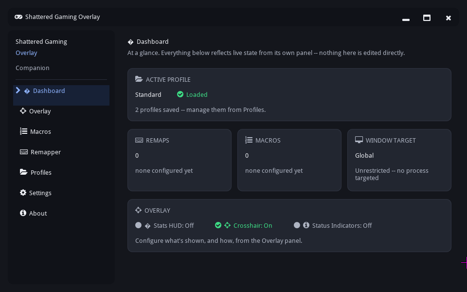
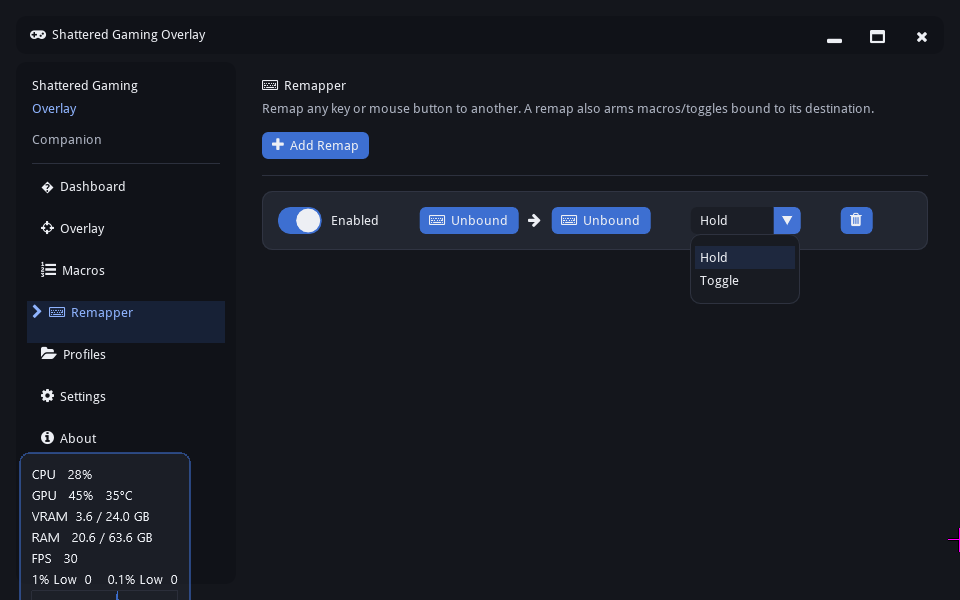
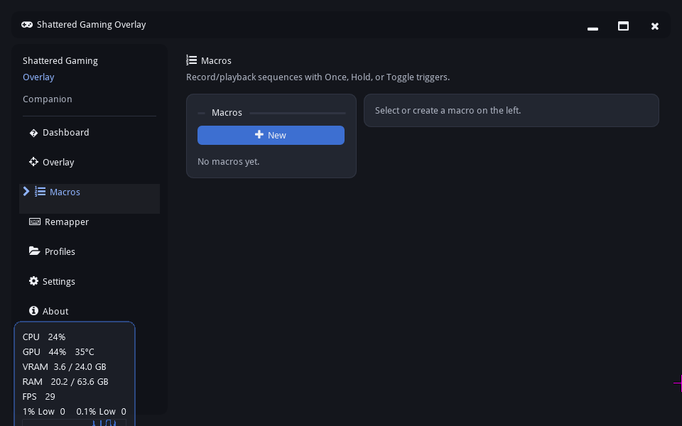
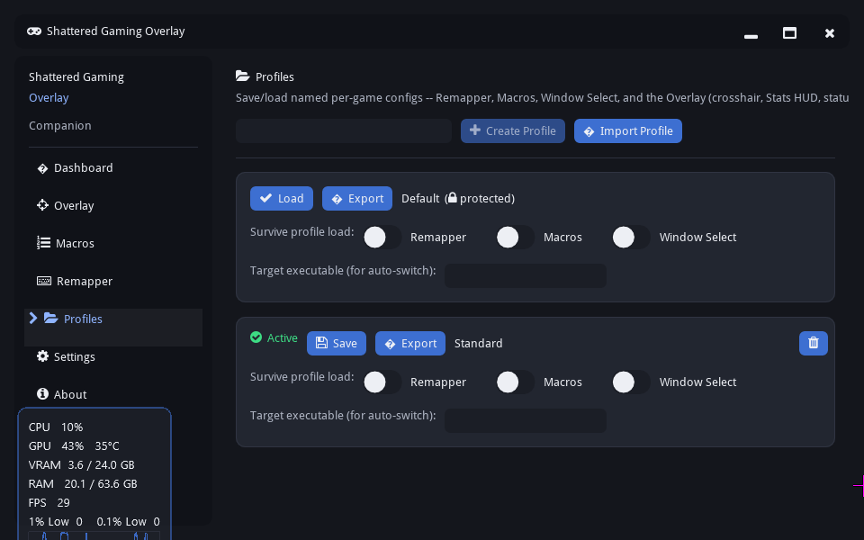
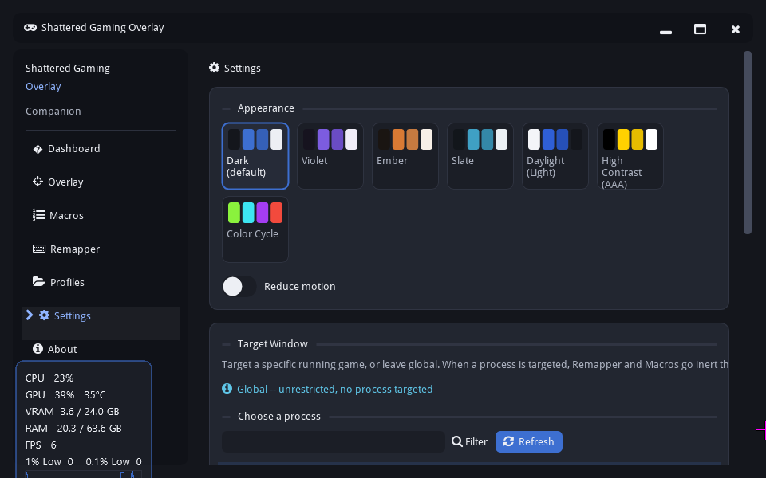

# Shattered Gaming Overlay

A gaming accessibility companion for Windows — remap keys and mouse buttons, build macros, run a live stats/crosshair overlay, and switch configs per game. No kernel driver, no virtual controller, no reading game memory. Just user-mode Win32 input APIs, the same layer AutoHotkey runs on.

## Features

### Remapper

Remap any key or mouse button to another. Entries support two modes: **Hold**, which mirrors the source key 1:1, and **Toggle**, which latches the destination on with one press and releases it on the next — handy for sprint or crouch in games that don't offer a toggle option of their own. A remap's destination also arms macros and status tracking, so the rest of the app reacts to what you actually intended to press, not just the raw key.

### Macros

Record a sequence and play it back with Once, Hold, or Toggle triggers. Playback timing is humanized rather than robotically exact.

### Profiles

Save named configs per game — Remapper, Macros, window targeting, and Overlay settings all travel together. Point a profile at a specific `.exe` and turn on auto-switch in Settings, and it loads itself the moment that game gets focus. Export a profile to a file and hand it to a friend; importing one always adds it as new, so you never lose your own setup by accident.

### Overlay

A passive HUD that sits over the game: CPU/GPU load and temps, VRAM/RAM, FPS with 1% and 0.1% lows plus a live graph, an accessibility crosshair, and status indicators for what's currently active. It's a separate, click-through window — never a hook into the game's own renderer, and never something you can accidentally interact with mid-match.

### Personalization

Seven themes, from a plain dark default to a AAA-contrast mode for low vision, plus a reduce-motion switch.

Remapper and Macros can also be scoped to one running process — target a game and both go inert the instant it loses focus, so nothing you've bound reaches the rest of your desktop while you're alt-tabbed out.

## Why no driver

The predecessor to this project used a kernel-mode driver for input. That's a heavier, more invasive approach than an accessibility tool needs, and a lot of anti-cheat software either flags or outright blocks it. Shattered Gaming Overlay stays entirely in user mode:

- **Capture** — `SetWindowsHookEx` (`WH_KEYBOARD_LL` / `WH_MOUSE_LL`)
- **Injection** — `SendInput`
- **Never** — a kernel driver, ViGEm/virtual-controller emulation, or reads/writes into a game process's memory

That's the whole reason this exists as a separate project rather than a version bump to the old one: fewer capabilities, but compatible with far more games.

## Getting started

Grab the latest installer from [Releases](../../releases), run it, and launch the app. It asks for admin — that's for the FPS counter, which uses the same ETW tracing tech as RTSS and MSI Afterburner and needs elevation to attach. Everything else runs fine without it, but the app requests admin up front rather than juggling permissions per feature.

Windows 10 or later required. The app checks for updates against GitHub Releases on launch and can update itself in place.

## What's next

Not built yet, on the list:

- **Shift layers** — hold one modifier key to remap a whole second set of keys to different destinations, similar to reWASD. Multiplies what a small set of reachable keys can do without new hardware.
- **Controller support** — XInput/DirectInput polling alongside the existing keyboard/mouse hook, with the Remapper panel split into separate Controller and KBM sections once it lands.

## Architecture

Companion software, not an in-game menu — no configuration UI ever draws on top of the game itself. Two windows, one UI toolkit:

- **Companion window** — every panel shown above. A normal desktop window with normal OS chrome, the way you'd interact with Discord's client or MSI Afterburner's main window.
- **HUD overlay** — the click-through layer that renders whatever's toggled on in the Overlay panel. No menus, never receives input.

Both run on Dear ImGui — no Qt, no Tkinter. The Companion window uses `imgui_bundle`'s OpenGL3 backend; the HUD overlay drives its own DX11 + DirectComposition swap chain directly, since click-through, non-interactive rendering over another app's window is outside what any ImGui backend provides out of the box.

## License

MIT. See [LICENSE](LICENSE).
